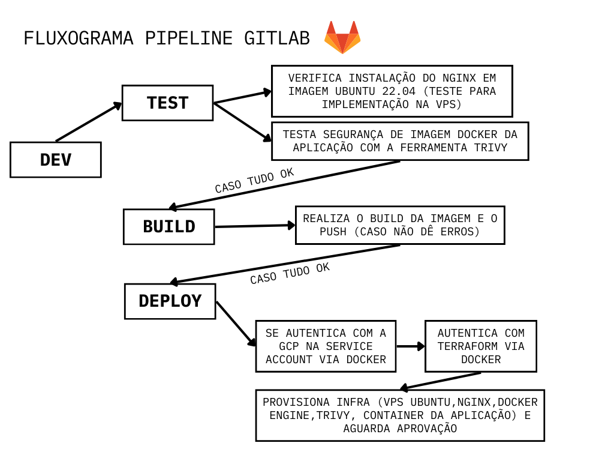

# Devops na Google Cloud

Este projeto consiste em realizar provisionamento de um servidor e hospedagem de website na Google Cloud, utilizando CI-CD e infra-as-code, com diversas ferramentas e configurações na melhor prática possível segunda as recomendações da GCP com segurança,grupos de segurança e configurações de rede provisionado totalmente por código.

## Tecnologias utilizadas

### Ferramentas
- Docker
- Terraform

### Linguagens
- Python
- Shell script

### Framework
- Flask

## Instruções de instalação e provisionamento

### 1 - Instalação do terraform no ubuntu

Caso possua outro sistema operacional verifique a documentação oficial neste [link](https://developer.hashicorp.com/terraform/tutorials/aws-get-started/install-cli)
   
- [ ] Confira o sistema e pacotes necessários.
```
sudo apt-get update && sudo apt-get install -y gnupg software-properties-common
```
- [ ] Instale a chave GPG
```
wget -O- https://apt.releases.hashicorp.com/gpg | \
gpg --dearmor | \
sudo tee /usr/share/keyrings/hashicorp-archive-keyring.gpg > /dev/null
```
- [ ] Adicione o repositorio oficial da Hashicorp
```
echo "deb [signed-by=/usr/share/keyrings/hashicorp-archive-keyring.gpg] \
https://apt.releases.hashicorp.com $(lsb_release -cs) main" | \
sudo tee /etc/apt/sources.list.d/hashicorp.list
```
- [ ] Instale o terraform
```
sudo apt update; sudo apt-get install terraform
```
- [ ] Caso queira, confira a instalação
```
terraform -v
```
### 2 - Instalação do GCP CLI
Mais informações neste [link](https://cloud.google.com/sdk/docs/install-sdk?hl=pt-br&cloudshell=false#deb)

- [ ] Confira pacotes e programas antes da instalação
```
sudo apt-get install apt-transport-https ca-certificates gnupg curl
```
- [ ] Importe a chave pública do Google Cloud.
```
curl https://packages.cloud.google.com/apt/doc/apt-key.gpg | sudo gpg --dearmor -o /usr/share/keyrings/cloud.google.gpg
```
- [ ] Adicione o URI de distribuição da CLI gcloud como uma origem de pacote.
```
echo "deb [signed-by=/usr/share/keyrings/cloud.google.gpg] https://packages.cloud.google.com/apt cloud-sdk main" | sudo tee -a /etc/apt/sources.list.d/google-cloud-sdk.list
```
- [ ] Atualize e instale a gcloud CLI.
```
sudo apt-get update && sudo apt-get install google-cloud-cli
```
- [ ] Execute gcloud init para começar.
```
gcloud init
```
- [ ] Aceite a opção de fazer login com sua conta de usuário do Google.
```
To continue, you must log in. Would you like to log in (Y/n)? Y
```
- [ ] No seu navegador, faça login na sua conta de usuário do Google quando solicitado e clique em Permitir para permitir acesso aos recursos do Google Cloud.
- [ ] No prompt de comando, selecione um projeto do Google Cloud na lista. de projetos em que você tem permissões de Proprietário, Editor ou Leitor.
```
Pick cloud project to use:
 [1] [my-project-1]
 [2] [my-project-2]
 ...
 Please enter your numeric choice:
```

Após isso você já estará autenticado com o CLI!

### 3 - Autenticação do Terraform com a GCP

  Primeiramente precisaremos fazer a criação de uma service account para podermos fazer o provisionamento no terraform somente da VPS, utilizando a recomendação amplamete utilizada em diversos casos garantindo isolamento de credenciais, mínimos priivlégios e facilitando auditorias, com total conformidade com as políticas de segurança.

- [ ] Crie uma service account
```
gcloud iam service-accounts create sva-terraform-coodesh --display-name "sva-terraform-coodesh"
```
- [ ] Liste as service accounts e copie o email da service account desejada.
```
gcloud iam service-accounts list
```
- [ ] Gere o arquivo de chave de service account (json)
```
gcloud iam service-accounts keys create key.json --iam-account <email-da-service-account-desejada>
```
- [ ] Setando variável de ambiente do project-id, credenciasi necessárias e região onde estará a VPS.
```
export GOOGLE_CLOUD_PROJECT=<seu-project-id>;
export GOOGLE_APPLICATION_CREDENTIALS=$PWD/key.json;
export GOOGLE_REGION=us-central1;
export GOOGLE_ZONE=us-central1-a;
```
- [ ] Pegue o id do seu projeto e copie-o
```
gcloud projects list
```
- [ ] Liberar permissões de compute e network para a service account, mais informações neste [link.](https://cloud.google.com/iam/docs/understanding-roles#compute-engine-roles)
```
export GOOGLE_CLOUD_PROJECT="seu-project-id";
export SERVICE_ACCOUNT_EMAIL="<email-da-service-account>";
gcloud projects add-iam-policy-binding $GOOGLE_CLOUD_PROJECT \
  --member "serviceAccount:$SERVICE_ACCOUNT_EMAIL" \
  --role "roles/compute.instanceAdmin.v1" && \
gcloud projects add-iam-policy-binding $GOOGLE_CLOUD_PROJECT \
  --member "serviceAccount:$SERVICE_ACCOUNT_EMAIL" \
  --role "roles/compute.networkAdmin" && \
gcloud projects add-iam-policy-binding $GOOGLE_CLOUD_PROJECT \
  --member "serviceAccount:$SERVICE_ACCOUNT_EMAIL" \
  --role "roles/cloudbuild.integrationsOwner" && \
gcloud projects add-iam-policy-binding $GOOGLE_CLOUD_PROJECT \
  --member "serviceAccount:$SERVICE_ACCOUNT_EMAIL" \
  --role "roles/vpcaccess.serviceAgent" && \
gcloud projects add-iam-policy-binding $GOOGLE_CLOUD_PROJECT \
  --member "serviceAccount:$SERVICE_ACCOUNT_EMAIL" \
  --role "roles/storage.admin" && \
gcloud projects add-iam-policy-binding $GOOGLE_CLOUD_PROJECT \
  --member "serviceAccount:$SERVICE_ACCOUNT_EMAIL" \
  --role "roles/compute.securityAdmin"

```

- [ ] Inicializando o terraform, e provisionando a VPS.
```
terraform init
terraform plan
terraform apply
```
  Após isso será necessário aguardar em torno de 8-10 minutos (devido a baixa potência da VPS) e acessar o link com http.
```
curl http://<ip-publico-da-vps>
```

## Fluxograma



## Passos na executados no desafio.

### 1 - Configuração do Servidor

1. Configuração de IAM com segurança na GCP*
2. Configuração da redes para o Servidor*
3. Configuração do servidor na GCP (mais barato possivel) com Ubuntu LTS.*
4. Instalação de configuração de softwares recomendados sob as perspectivas de segurança(docker,nginx-proxy), desempenho(alpine), backup e monitorização.*
5. Configuração do nginx para servir uma página web HTML estática.*

### 2 - Infra as Code

1. Utilizando o Terraform*

Projeto executando em um servidor e com as melhores práticas de segurança com grupos de segurança(service-account) e as configurações de rede criando completamente por código.*

### 3 - Continuous Delivery

Pipeline de apoio para a entrega contínua da aplicação de monitorização construída na Parte 2 no servidor configurado na Parte 1.*

Descrever a pipeline utilizando um diagrama de fluxo e explicar o objetivo e o processo de seleção usado em cada uma das ferramentas e técnicas específicas que compõem a sua pipeline. *
